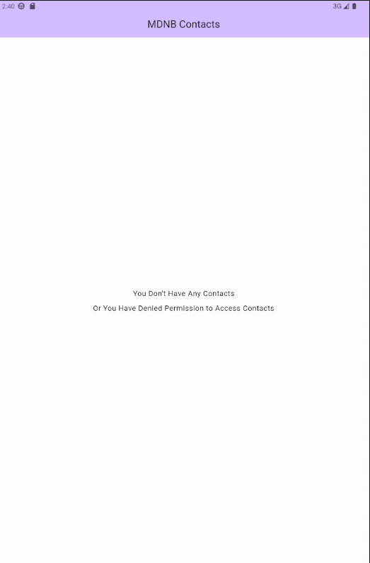
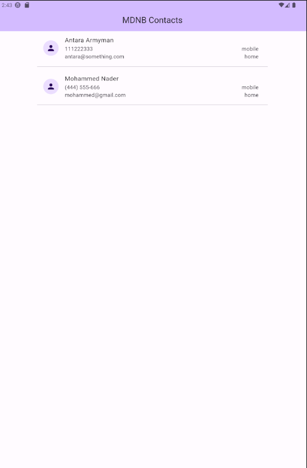
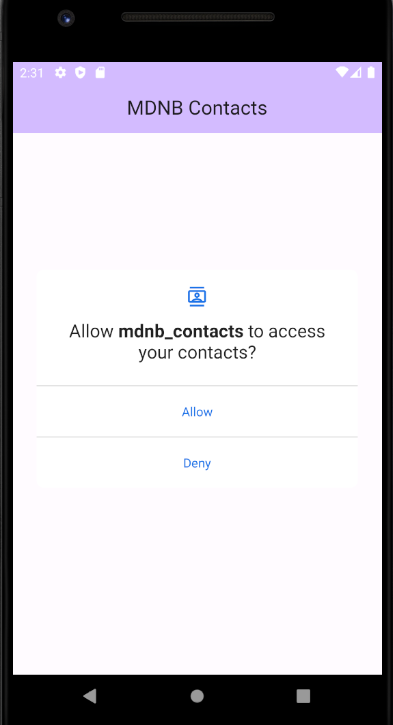
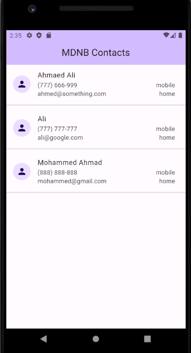

# MDNB Contacts

An alternative to in-device contacts app.

  
  
  

  
  
  

## Languages, Frameworks and Libraries Used

- Flutter, Dart
- permission_handler
- fast_contacts

#### License MIT
